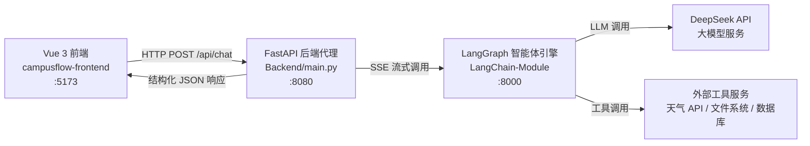
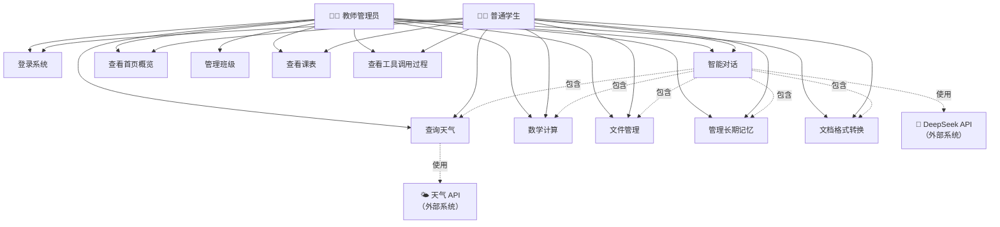
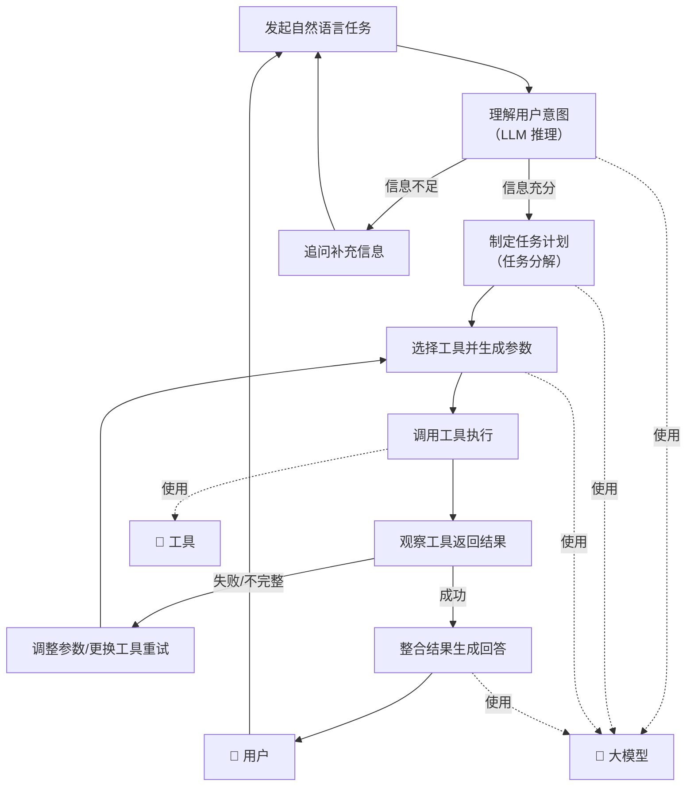
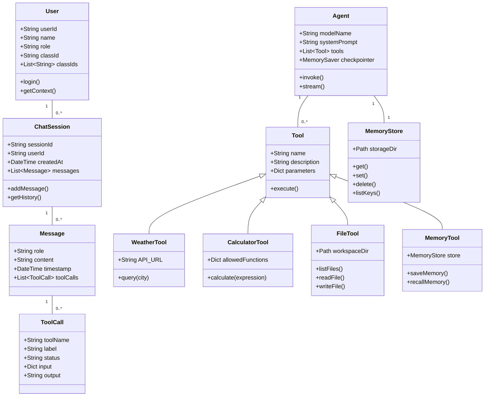
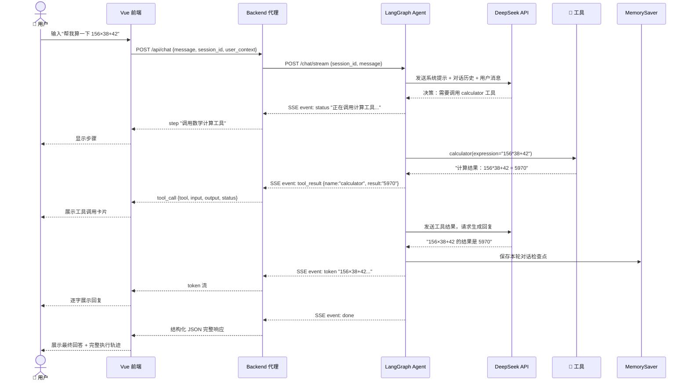
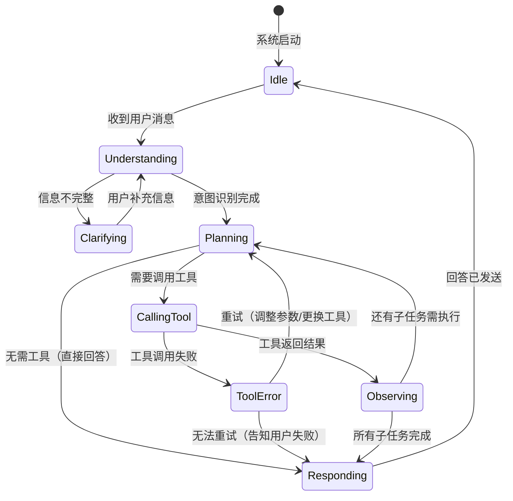

# 软件需求规格说明书（SRS）

---

## 目录

1. [引言](#1-引言)
   - 1.1 编写目标
   - 1.2 读者对象
   - 1.3 文档概述
   - 1.4 术语定义
   - 1.5 参考文献
2. [软件系统概述](#2-软件系统概述)
   - 2.1 软件产品概述
   - 2.2 用户特征
   - 2.3 设计和实现约束
   - 2.4 假设与依赖
3. [功能性需求描述](#3-功能性需求描述)
   - 3.1 软件功能概述
   - 3.2 软件需求的用例模型（UML 用例图）
   - 3.3 软件需求的分析模型
4. [非功能性需求](#4-非功能性需求)
5. [界面需求](#5-界面需求)
6. [接口定义](#6-接口定义)
7. [进度要求](#7-进度要求)
8. [交付要求](#8-交付要求)
9. [验收要求](#9-验收要求)

---

## 1. 引言

### 1.1 编写目标

本文档旨在对 **SchAgent——基于大模型的工具调用智能体系统** 进行完整、精确的软件需求规格说明。通过本文档：

- 明确系统的功能边界、用户角色与核心业务流程；
- 采用 UML 用例图、顺序图、类图、状态图等建模手段，从多视角刻画系统需求；
- 为后续设计、编码、测试与验收提供统一的需求基线；
- 作为开发团队与利益相关方（教师用户、学生用户、系统管理员）之间沟通的契约文件。

### 1.2 读者对象

| 读者类别              | 说明             | 关注重点                                   |
| --------------------- | ---------------- | ------------------------------------------ |
| 用户代表（教师/学生） | 系统的最终使用者 | 功能是否满足日常校园场景需求，操作是否便捷 |
| 项目开发团队          | 前后端开发人员   | 功能需求细节、接口契约、约束条件           |
| 测试人员              | 验收测试执行者   | 验收测试用例、功能覆盖率要求               |
| 指导教师/评审方       | 课程评审         | 需求文档完整性、建模规范性、创新点体现     |

### 1.3 文档概述

本文档遵循课件《需求分析》[27:143] 建议的标准 SRS 大纲结构，共分为九个章节：

- **第 1 章** 介绍文档的基本信息；
- **第 2 章** 概述软件产品定位、用户特征、约束与假设；
- **第 3 章** 详细描述功能性需求，包含 UML 用例图、分析类图、顺序图与状态图；
- **第 4 章** 描述非功能性需求（性能、可靠性、易用性、安全性等）；
- **第 5 章** 描述用户界面需求；
- **第 6 章** 定义系统内外部接口；
- **第 7~9 章** 描述进度、交付与验收要求。

### 1.4 术语定义

| 术语                               | 英文/缩写            | 定义                                                                          |
| ---------------------------------- | -------------------- | ----------------------------------------------------------------------------- |
| **大模型（LLM）**            | Large Language Model | 以 DeepSeek-V4 为代表的大规模语言模型，能够理解自然语言并生成回复             |
| **智能体（Agent）**          | Agent                | 具备"感知—规划—行动—观察"循环的自治软件实体，本系统中由 LangGraph 框架驱动 |
| **工具（Tool）**             | Tool                 | 智能体可调用的外部功能单元，如天气查询、数学计算、文件读写等                  |
| **工具调用（Tool Calling）** | Function Calling     | 大模型根据用户意图，自主决定调用哪个工具及其参数的过程                        |
| **LangChain / LangGraph**    | —                   | LLM 应用开发框架，LangGraph 提供有状态的图驱动智能体执行引擎                  |
| **MemorySaver**              | —                   | LangGraph 内置的会话检查点机制，自动持久化对话历史                            |
| **UserMemoryStore**          | —                   | 本系统自建的长期记忆存储模块，基于 JSON 文件跨会话保存用户偏好与课表等信息    |
| **SSE**                      | Server-Sent Events   | 服务器向客户端推送实时事件的 HTTP 协议机制                                    |
| **线程（Thread）**           | Thread               | LangGraph 中的会话隔离单元，每个 thread_id 对应一个独立对话                   |
| **平台上下文**               | Platform Context     | 携带当前登录用户角色、班级、课程等业务数据的上下文对象                        |

### 1.5 参考文献

1. 课件《需求分析》，第 27 章——需求规格说明书与建模方法
2. LangChain 官方文档：https://python.langchain.com/
3. LangGraph 官方文档：https://langchain-ai.github.io/langgraph/
4. DeepSeek API 文档：https://platform.deepseek.com/api-docs/
5. FastAPI 官方文档：https://fastapi.tiangolo.com/
6. Vue 3 官方文档：https://cn.vuejs.org/

---

## 2. 软件系统概述

### 2.1 软件产品概述

#### 2.1.1 产品定位

**SchAgent** 是一款面向校园生活场景的大模型工具调用智能体系统。与普通聊天问答系统不同，SchAgent 的核心能力在于 **"理解任务 → 制定计划 → 调用工具 → 观察结果 → 调整策略 → 完成任务"** 的完整智能体工作流。用户通过自然语言提出问题或任务，系统利用 DeepSeek 大模型理解意图，自主判断是否需要调用工具，并选择相应工具完成信息查询、数据处理、文件操作等任务。

#### 2.1.2 业务场景

系统模拟了一个真实的校园信息平台，涵盖以下业务场景：

- **天气查询**：查询指定城市的实时天气、空气质量、生活指数与气象预警；
- **数学计算**：安全执行数学表达式计算，支持初等函数；
- **时间查询**：获取当前日期与时间；
- **文件管理**：在工作区中列出、读取、写入文件；
- **长期记忆**：跨会话保存/读取用户的课表、偏好、笔记等信息；
- **文档转换**：将 Markdown 文本转为 HTML 或 PDF 格式；
- **班级管理**（平台功能）：教师创建班级、分配学生、维护课表；
- **课表查询**：教师按班级查看课表，学生查看本人课表。

#### 2.1.3 整体架构

系统采用 **三层分离架构**：



| 层级                   | 技术栈                                 | 职责                                                         |
| ---------------------- | -------------------------------------- | ------------------------------------------------------------ |
| **前端层**       | Vue 3 + Vite + Axios                   | 提供 Web 可视化交互界面，展示对话、工具调用过程与结果        |
| **后端代理层**   | Python FastAPI + httpx                 | 接收前端请求，调用 Agent API，将 SSE 流编译为前端结构化 JSON |
| **智能体引擎层** | LangGraph + DeepSeek + LangChain Tools | 管理会话记忆、执行工具调用、生成自然语言回复                 |
| **大模型服务**   | DeepSeek API (deepseek-v4-flash)       | 提供自然语言理解与生成能力                                   |
| **外部工具服务** | 天气 API、本地文件系统、SQLite 数据库  | 提供可被智能体调用的具体工具能力                             |

#### 2.1.4 核心特性

1. **自然语言理解**：准确识别用户查询意图、目标实体与约束条件；
2. **任务规划与分解**：将多步骤任务分解为若干子任务并确定执行顺序；
3. **工具自主调用**：不少于 10 种工具，每个工具具有明确的名称、功能说明、参数与返回值；
4. **智能体执行闭环**：实现"理解→调用→观察→回答"的完整流程；
5. **容错与重试**：工具调用失败或结果不完整时，能够重新选择工具或调整参数；
6. **过程透明化**：展示所调用工具、主要执行步骤与关键结果；
7. **会话记忆**：利用 LangGraph MemorySaver 自动管理对话历史，不同会话完全隔离；
8. **长期记忆**：基于 JSON 的 UserMemoryStore，跨会话持久化用户课表、偏好等信息；
9. **角色权限**：支持教师管理员与普通学生两类角色，按角色展示不同功能与数据；
10. **流式响应**：通过 SSE 实时推送 Agent 思考状态、工具调用与回复内容。

### 2.2 用户特征

#### 2.2.1 用户角色定义

| 角色                 | 典型代表       | 技术背景               | 使用频率 | 核心需求                                                           |
| -------------------- | -------------- | ---------------------- | -------- | ------------------------------------------------------------------ |
| **教师管理员** | 班主任、辅导员 | 具备基本计算机操作能力 | 日常使用 | 管理班级信息、维护课表、查询天气安排活动、借助智能助手处理班级事务 |
| **普通学生**   | 在校大学生     | 熟悉移动/Web 应用      | 日常使用 | 查看个人课表、查询天气、数学计算、文件处理、借助智能助手获取信息   |
| **系统管理员** | 开发/运维人员  | 专业技术背景           | 低频维护 | 部署服务、监控运行状态、排查故障                                   |

#### 2.2.2 用户技能假设

- 所有用户具备基本的 Web 浏览器操作能力；
- 用户能够使用自然语言（中文）描述需求与问题；
- 教师用户理解班级管理的基本流程；
- 不要求用户具备编程或命令行操作能力。

### 2.3 设计和实现约束

| 约束类别             | 约束描述                                                                                         |
| -------------------- | ------------------------------------------------------------------------------------------------ |
| **技术栈约束** | 后端须基于 Python（FastAPI + LangChain/LangGraph）；前端须基于 Vue 3；大模型须使用 DeepSeek 系列 |
| **部署约束**   | 系统以本地开发模式运行，三个服务（前端、后端代理、Agent 引擎）各自独立启动                       |
| **网络约束**   | Agent 引擎需要访问公网 DeepSeek API 与 uapis.cn 天气 API，需要稳定的互联网连接                   |
| **安全约束**   | 文件操作限定在工作区目录内，禁止路径遍历；数学计算禁用裸`eval()`，使用受限命名空间             |
| **数据约束**   | 长期记忆以 JSON 文件存储于服务端本地；学生账号数据存储于 SQLite 数据库                           |
| **浏览器约束** | 前端支持现代浏览器（Chrome 90+、Edge 90+、Firefox 88+）                                          |
| **语言约束**   | 系统界面与交互语言为简体中文；代码注释与文档使用中文                                             |

### 2.4 假设与依赖

| 编号 | 假设/依赖                  | 说明                                                         |
| ---- | -------------------------- | ------------------------------------------------------------ |
| H-01 | DeepSeek API 可用且稳定    | 系统核心推理能力依赖 DeepSeek API，需有效 API Key 与网络连接 |
| H-02 | uapis.cn 天气 API 持续可用 | 天气查询功能依赖第三方免费 API，格式变更可能影响功能         |
| H-03 | 用户具有唯一标识           | 系统假设每个用户以用户名区分，用于长期记忆隔离               |
| H-04 | 单机部署                   | 当前版本假设所有服务运行在同一台机器上                       |
| H-05 | 会话为短连接               | 假设单次会话时长不超过 2 小时，超长会话可能需要重新建立      |
| H-06 | 工作区目录可读写           | Agent 的文件操作工具依赖工作区目录的文件系统权限             |
| D-01 | Python 3.10+ 环境          | 后端与 Agent 引擎需要 Python 3.10 及以上版本                 |
| D-02 | Node.js 18+ 环境           | 前端开发与构建需要 Node.js 18 及以上版本                     |
| D-03 | 依赖包可正常安装           | requirements.txt 与 package.json 中的依赖须可正常下载安装    |

---

## 3. 功能性需求描述

### 3.1 软件功能概述

系统功能按模块划分为六大类：

| 功能模块           | 编号 | 功能点                               | 优先级 |
| ------------------ | ---- | ------------------------------------ | ------ |
| **智能对话** | F-01 | 自然语言理解与意图识别               | 高     |
|                    | F-02 | 信息不完整时主动追问                 | 高     |
|                    | F-03 | 多轮对话上下文记忆                   | 高     |
|                    | F-04 | 流式回复实时展示                     | 中     |
| **工具调用** | F-05 | 工具自主选择与参数生成               | 高     |
|                    | F-06 | 工具调用结果观察与整合               | 高     |
|                    | F-07 | 工具调用失败重试与策略调整           | 中     |
|                    | F-08 | 多工具协同调用（任务分解）           | 中     |
| **工具集**   | F-09 | 天气查询（get_weather）              | 高     |
|                    | F-10 | 安全数学计算（calculator）           | 高     |
|                    | F-11 | 当前时间查询（get_current_time）     | 高     |
|                    | F-12 | 工作区文件列表（list_files）         | 中     |
|                    | F-13 | 文件内容读取（read_file）            | 中     |
|                    | F-14 | 文件内容写入（write_file）           | 中     |
|                    | F-15 | 长期记忆保存（save_memory）          | 中     |
|                    | F-16 | 长期记忆读取（recall_memory）        | 中     |
|                    | F-17 | Markdown 转 HTML（markdown_to_html） | 低     |
|                    | F-18 | Markdown 转 PDF（markdown_to_pdf）   | 低     |
| **平台功能** | F-19 | 用户登录与角色识别                   | 高     |
|                    | F-20 | 首页数据概览（Dashboard）            | 中     |
|                    | F-21 | 班级创建与管理（教师）               | 中     |
|                    | F-22 | 学生班级分配（教师）                 | 中     |
|                    | F-23 | 课表查看（教师/学生）                | 中     |
| **过程透明** | F-24 | 展示任务执行步骤                     | 高     |
|                    | F-25 | 展示工具调用详情（名称、参数、结果） | 高     |
|                    | F-26 | 展示结构化结果（表格/图表）          | 中     |
| **异常处理** | F-27 | 用户输入不完整提示                   | 高     |
|                    | F-28 | 工具参数错误提示                     | 高     |
|                    | F-29 | 工具调用失败提示与引导               | 高     |
|                    | F-30 | 网络异常与重试提示                   | 高     |

### 3.2 软件需求的用例模型（UML 用例图）

#### 3.2.1 顶层用例图



#### 3.2.2 智能体核心用例——工具调用流程



#### 3.2.3 用例详述（以"查询天气并给出穿衣建议"为例）

| 项目               | 内容                                                                                                                                                                                                                                                                                       |
| ------------------ | ------------------------------------------------------------------------------------------------------------------------------------------------------------------------------------------------------------------------------------------------------------------------------------------ |
| **用例编号** | UC-03                                                                                                                                                                                                                                                                                      |
| **用例名称** | 查询天气并给出穿衣建议                                                                                                                                                                                                                                                                     |
| **参与者**   | 学生 / 教师                                                                                                                                                                                                                                                                                |
| **前置条件** | 用户已登录系统；互联网连接正常                                                                                                                                                                                                                                                             |
| **后置条件** | 系统展示天气信息及穿衣建议                                                                                                                                                                                                                                                                 |
| **基本流程** | 1. 用户输入："今天北京天气怎么样？适合穿什么？"2. 系统理解意图：查询北京天气 + 需要穿衣建议3. 系统调用`get_weather(city="北京")` 工具4. 工具返回天气数据（温度、风力、湿度、穿衣指数等）5. 系统整合结果，生成包含天气详情与穿衣建议的自然语言回复6. 系统同时展示工具调用详情（天气查询） |
| **异常流程** | 3a. 天气 API 超时 → 系统提示"天气服务暂时无法连接"，引导用户稍后重试3b. 城市名无效 → 系统提示"未找到该城市"，引导用户修正城市名3c. 用户未指定城市 → 系统追问"请问你想查询哪个城市的天气？"                                                                                              |

### 3.3 软件需求的分析模型

#### 3.3.1 分析类图



#### 3.3.2 核心交互——顺序图（一次完整的工具调用对话）



#### 3.3.3 智能体状态图



**状态说明**：

| 状态                    | 含义               | 前端展示               |
| ----------------------- | ------------------ | ---------------------- |
| **Idle**          | 空闲，等待用户输入 | 显示输入框             |
| **Understanding** | 正在分析用户意图   | "正在思考..."          |
| **Clarifying**    | 信息不足，需要追问 | 显示追问问题           |
| **Planning**      | 制定任务执行计划   | "正在制定计划..."      |
| **CallingTool**   | 正在调用工具       | 显示工具名称与参数     |
| **Observing**     | 正在分析工具结果   | 显示工具返回结果       |
| **ToolError**     | 工具调用异常       | 显示错误信息与重试状态 |
| **Responding**    | 生成最终回答       | 逐字流式展示回复       |

#### 3.3.4 工具定义详表

| 工具名称             | 功能说明             | 输入参数                                             | 返回结果                                      | 异常处理                                            |
| -------------------- | -------------------- | ---------------------------------------------------- | --------------------------------------------- | --------------------------------------------------- |
| `get_weather`      | 查询指定城市实时天气 | `city: str`（城市名）                              | 天气报告（温度、湿度、风力、AQI、穿衣建议等） | API 超时/连接失败返回友好提示；城市无效返回引导信息 |
| `calculator`       | 安全执行数学计算     | `expression: str`（数学表达式）                    | 计算结果字符串                                | 非法表达式返回错误说明                              |
| `get_current_time` | 获取当前日期时间     | 无                                                   | 格式化时间字符串                              | —                                                  |
| `list_files`       | 列出工作区文件       | 无                                                   | 文件/目录列表                                 | 目录不可读返回错误                                  |
| `read_file`        | 读取文件内容         | `file_name: str`                                   | 文件内容字符串                                | 文件不存在返回提示；路径遍历攻击被拦截              |
| `write_file`       | 写入文件内容         | `file_name: str`, `content: str`                 | 操作结果确认                                  | 路径遍历攻击被拦截                                  |
| `save_memory`      | 保存长期记忆         | `username: str`, `key: str`, `content: str`    | 保存确认                                      | JSON 序列化失败返回错误                             |
| `recall_memory`    | 读取长期记忆         | `username: str`, `key: str`（可选）              | 记忆内容或键名列表                            | 无记忆时返回提示                                    |
| `markdown_to_html` | Markdown 转 HTML     | `markdown_text: str`                               | HTML 字符串                                   | 依赖缺失返回安装提示                                |
| `markdown_to_pdf`  | Markdown 转 PDF      | `markdown_text: str`, `output_file: str`（可选） | PDF 文件路径                                  | 依赖缺失返回安装提示                                |

---

## 4. 非功能性需求

### 4.1 性能需求

| 编号   | 需求项       | 指标要求                                                                   |
| ------ | ------------ | -------------------------------------------------------------------------- |
| NF-P01 | 首次响应时间 | 用户发送消息后，系统应在**3 秒内** 给出首个状态反馈（"正在思考..."） |
| NF-P02 | 工具调用延迟 | 单次工具调用（不含 LLM 推理）应在**5 秒内** 返回结果                 |
| NF-P03 | 完整回复时间 | 简单问答（无工具调用）应在**10 秒内** 完成完整回复                   |
| NF-P04 | 流式传输延迟 | 首个 token 应在 LLM 开始生成后**500ms 内** 推送到前端                |
| NF-P05 | 并发会话数   | 系统应支持至少**5 个并发会话** 同时进行而不显著降级                  |

### 4.2 可靠性需求

| 编号   | 需求项         | 指标要求                                                                 |
| ------ | -------------- | ------------------------------------------------------------------------ |
| NF-R01 | 服务可用性     | Agent 引擎 7×24 小时可运行（开发模式除外）                              |
| NF-R02 | 错误恢复       | 工具调用失败后，系统应能自动重试至少**1 次**，或提供明确的失败原因 |
| NF-R03 | 会话数据持久性 | 对话历史应在服务重启后仍可恢复（通过 MemorySaver 检查点）                |
| NF-R04 | 长期记忆持久性 | 用户长期记忆数据以 JSON 文件持久化存储，不因服务重启丢失                 |

### 4.3 易用性需求

| 编号   | 需求项     | 说明                                                 |
| ------ | ---------- | ---------------------------------------------------- |
| NF-U01 | 界面直观性 | 新用户无需培训即可通过自然语言发起任务               |
| NF-U02 | 过程透明性 | 所有工具调用过程对用户可见，包含工具名称、参数与结果 |
| NF-U03 | 错误友好性 | 错误提示使用自然语言，避免技术术语，并附带操作建议   |
| NF-U04 | 快捷操作   | 提供常用问题的快捷入口（一键提问）                   |
| NF-U05 | 响应式布局 | 界面适配桌面端主流分辨率（1280×720 及以上）         |

### 4.4 安全性需求

| 编号   | 需求项       | 说明                                                                  |
| ------ | ------------ | --------------------------------------------------------------------- |
| NF-S01 | 路径遍历防护 | 文件读写操作禁止访问工作区目录以外的路径                              |
| NF-S02 | 代码注入防护 | 数学计算禁止使用裸`eval()`，使用受限命名空间 + `compile()` 白名单 |
| NF-S03 | API Key 保护 | DeepSeek API Key 通过环境变量配置，不硬编码在源码中                   |
| NF-S04 | 用户数据隔离 | 不同用户的长期记忆按用户名分别存储，互不可见                          |
| NF-S05 | 会话隔离     | 不同 session_id 的对话历史通过 LangGraph thread_id 机制完全隔离       |
| NF-S06 | 密码安全     | 用户密码使用 PBKDF2-SHA256 哈希存储，不存储明文                       |

### 4.5 可维护性需求

| 编号   | 需求项     | 说明                                                            |
| ------ | ---------- | --------------------------------------------------------------- |
| NF-M01 | 模块化架构 | 三层架构（前端/后端代理/Agent引擎）职责清晰，可独立开发与调试   |
| NF-M02 | 配置外置   | 所有环境相关配置（端口、API Key、模型名称）通过环境变量管理     |
| NF-M03 | 日志记录   | 工具调用过程输出日志到控制台（`[Tool] tool_name(args)` 格式） |
| NF-M04 | 健康检查   | 每个服务提供`/health` 端点，便于监控运行状态                  |

---

## 5. 界面需求

### 5.1 总体布局

系统前端采用**模拟校园信息平台布局**，包含以下页面：

```text
┌──────────────────────────────────────────────┐
│  SchAgent 校园生活智能助手                      │
├──────────┬───────────────────────────────────┤
│          │                                   │
│  导航栏   │         内容区域                   │
│          │                                   │
│ ·首页    │  根据当前页面展示不同内容：           │
│ ·班级管理 │  - 首页：数据概览卡片               │
│ ·课表    │  - 班级管理：班级/学生/课程管理表格    │
│ ·智能助手 │  - 课表：课程表视图                 │
│          │  - 智能助手：三栏布局（见下方）       │
│          │                                   │
├──────────┴───────────────────────────────────┤
│  底部：用户信息 | 退出登录                      │
└──────────────────────────────────────────────┘
```

### 5.2 智能助手页面布局（核心页面）

```text
┌──────────┬──────────────────────┬─────────────────────┐
│ 快捷问题  │     对话区            │   智能体执行轨迹      │
│          │                      │                     │
│  今天   │ ┌──────────────────┐ │ 📋 执行步骤          │
│   天气   │ │ 用户: xxx         │ │ 1. 识别任务          │
│          │ │                  │ │ 2. 调用天气查询工具   │
│  计算   │ │ Agent: 正在思考...  │ │ 3. 分析结果          │
│   帮助   │ │                  │ │ 4. 生成回复          │
│          │ │ 工具调用卡片      │ │                     │
│  查看   │ │ [天气查询] ✓     │ │ 🔧 工具调用详情      │
│   文件   │ │ 输入: 北京       │ │ ┌─────────────────┐ │
│          │ │ 输出: 晴 25°C   │ │ │ get_weather     │ │
│          │ │                  │ │ │ city: 北京      │ │
│          │ │ Agent: 北京今天...  │ │ │ → 晴 25°C       │ │
│          │ └──────────────────┘ │ └─────────────────┘ │
│          │                      │                     │
│          │ [输入框] [发送]       │                     │
└──────────┴──────────────────────┴─────────────────────┘
```

### 5.3 页面清单

| 页面               | 路由           | 功能描述                             | 访问角色 |
| ------------------ | -------------- | ------------------------------------ | -------- |
| **登录页**   | `/login`     | 输入账号密码，区分教师/学生角色      | 所有用户 |
| **首页概览** | `/dashboard` | 展示班级数、学生数、课程数、天气卡片 | 所有用户 |
| **班级管理** | `/admin`     | 创建班级、分配学生、添加课程         | 仅教师   |
| **课表页**   | `/schedule`  | 查看课表（教师按班级、学生看个人）   | 所有用户 |
| **智能助手** | `/chat`      | 三栏布局的智能对话页面（核心）       | 所有用户 |

### 5.4 界面元素规范

| 元素                   | 规范                                                                  |
| ---------------------- | --------------------------------------------------------------------- |
| **消息气泡**     | 用户消息右对齐（蓝色），Agent 回复左对齐（灰色），支持 Markdown 渲染  |
| **工具调用卡片** | 可折叠卡片，展示工具图标、名称、状态图标（✓/✗）、输入参数与输出结果 |
| **执行步骤列表** | 时间线样式，当前步骤高亮，已完成步骤带勾选标记                        |
| **结果表格**     | 当工具返回结构化数据时，以 HTML 表格形式渲染                          |
| **错误提示**     | 红色告警样式，包含错误原因与操作建议                                  |
| **加载状态**     | 思考中显示跳动的省略号动画；工具调用中显示旋转加载图标                |

---

## 6. 接口定义

### 6.1 系统内部接口

#### 6.1.1 前端 → 后端代理（Backend）

**接口**：`POST /api/chat`

**请求体**：

```json
{
  "session_id": "string | null",
  "message": "string",
  "user_context": {
    "user_id": "string",
    "name": "string",
    "role": "teacher | student",
    "class_id": "string | null",
    "class_ids": ["string"]
  },
  "platform_context": {
    "classes": [],
    "students": [],
    "courses": [],
    "weather": {}
  }
}
```

**响应体**（同步模式）：

```json
{
  "session_id": "string",
  "status": "success | failed | need_clarification",
  "answer": "string",
  "steps": ["string"],
  "tool_calls": [
    {
      "tool": "string",
      "label": "string",
      "status": "success | failed",
      "input": {},
      "output": "string"
    }
  ],
  "artifacts": [
    {
      "type": "table",
      "title": "string",
      "columns": ["string"],
      "rows": [["string"]]
    }
  ],
  "missing_fields": ["string"]
}
```

#### 6.1.2 后端代理 → Agent 引擎

**接口**：`POST /chat/stream`（SSE 流式）

SSE 事件类型：

| event 类型      | data 内容                                               | 说明                               |
| --------------- | ------------------------------------------------------- | ---------------------------------- |
| `status`      | `{"phase": "reasoning                                   | responding", "message": "string"}` |
| `token`       | `{"content": "string"}`                               | LLM 生成 token                     |
| `tool_call`   | `{"name": "string", "args": {}}`                      | 工具调用开始                       |
| `tool_result` | `{"name": "string", "result": "string", "success": true | false}`                            |
| `error`       | `{"message": "string"}`                               | 错误事件                           |
| `done`        | `{"session_id": "string"}`                            | 对话完成                           |

其他 Agent API 端点：

| 方法   | 路径                      | 说明           |
| ------ | ------------------------- | -------------- |
| GET    | `/health`               | 健康检查       |
| POST   | `/chat`                 | 同步对话       |
| GET    | `/history/{session_id}` | 获取会话历史   |
| DELETE | `/history/{session_id}` | 清除会话历史   |
| GET    | `/memory/{username}`    | 获取长期记忆   |
| PUT    | `/memory/{username}`    | 更新长期记忆   |
| DELETE | `/memory/{username}`    | 删除长期记忆   |
| GET    | `/files/{file_name}`    | 下载工作区文件 |
| GET    | `/files`                | 列出可下载文件 |

### 6.2 系统外部接口

| 接口              | 提供方        | 用途                           | 协议       |
| ----------------- | ------------- | ------------------------------ | ---------- |
| DeepSeek Chat API | DeepSeek 平台 | LLM 推理（自然语言理解与生成） | HTTPS REST |
| 天气 API          | uapis.cn      | 获取实时天气数据               | HTTPS REST |
| SQLite 本地数据库 | 本地文件系统  | 学生账号信息持久化             | 文件 I/O   |
| 工作区文件系统    | 本地文件系统  | Agent 文件读写操作             | 文件 I/O   |

---

## 7. 进度要求

| 阶段               | 内容                                             | 预计工期 | 里程碑           |
| ------------------ | ------------------------------------------------ | -------- | ---------------- |
| **需求分析** | 完成 SRS 文档，建立需求模型                      | Day 1    | SRS 评审通过     |
| **架构设计** | 完成系统架构设计、接口契约定义                   | Day 1    | 架构评审通过     |
| **核心开发** | Agent 引擎工具实现、LangGraph 集成、Backend 代理 | Day 2-4  | Agent 可独立对话 |
| **前端开发** | Vue 页面开发、平台布局、聊天界面                 | Day 2-4  | 前后端联通       |
| **联调集成** | 三层服务联调、SSE 流式调试                       | Day 4    | 全链路跑通       |
| **测试优化** | 10+ 测试用例执行、Bug 修复、性能优化             | Day 5    | 测试报告通过     |
| **文档交付** | 整理用户手册、开发文档、演示准备                 | Day 6    | 最终交付         |

---

## 8. 交付要求

### 8.1 交付物清单

| 编号 | 交付物                    | 格式              | 说明                              |
| ---- | ------------------------- | ----------------- | --------------------------------- |
| D-01 | 软件需求规格说明书（SRS） | Markdown / PDF    | 本文档                            |
| D-02 | 系统设计说明书            | Markdown / PDF    | 包含系统架构、软件设计            |
| D-03 | 源代码                    | 压缩包 / Git 仓库 | 包含所有前端、后端、Agent服务代码 |

### 8.2 交付形式

- 所有文档与源代码通过 Git 仓库提交；
- 现场演示 + 答辩。

---

## 9. 验收要求

### 9.1 验收测试计划概述

系统验收测试将围绕以下维度展开：

1. **功能完整性**：覆盖 SRS 第 3 章定义的所有功能点（F-01 至 F-30）；
2. **智能体工作流**：验证"理解→规划→调用→观察→回答"闭环是否完整；
3. **工具调用正确性**：统计工具选择正确率与参数生成准确率；
4. **异常处理**：验证信息不完整、工具失败、网络异常等边界场景；
5. **非功能性指标**：性能、可靠性、安全性等指标的达标情况。

### 9.2 验收测试用例（核心 12 条）

| 编号  | 测试类型   | 测试场景           | 输入                                                                 | 预期输出                                            | 对应功能点             |
| ----- | ---------- | ------------------ | -------------------------------------------------------------------- | --------------------------------------------------- | ---------------------- |
| TC-01 | 直接回答   | 简单常识问答       | "你好，请介绍一下你自己"                                             | Agent 自我介绍，无工具调用                          | F-01, F-03             |
| TC-02 | 直接回答   | 无需工具的知识问答 | "清华大学成立于哪一年？"                                             | 给出清华大学成立年份                                | F-01                   |
| TC-03 | 单工具调用 | 天气查询           | "今天北京天气怎么样？"                                               | 调用 get_weather，展示天气详情                      | F-05, F-06, F-09       |
| TC-04 | 单工具调用 | 数学计算           | "帮我算一下 156×38+42"                                              | 调用 calculator，返回 5970                          | F-05, F-06, F-10       |
| TC-05 | 单工具调用 | 时间查询           | "现在几点了？"                                                       | 调用 get_current_time，返回当前时间                 | F-05, F-11             |
| TC-06 | 多工具调用 | 计算+天气联合      | "北京今天温度是多少华氏度？摄氏转华氏"                               | 先调用 get_weather 获取温度，再调用 calculator 转换 | F-08, F-09, F-10       |
| TC-07 | 多工具调用 | 文件管理           | "帮我创建一个 notes.txt 文件，然后读取它的内容"                      | 先调用 write_file，再调用 read_file                 | F-08, F-12, F-13, F-14 |
| TC-08 | 多轮对话   | 上下文记忆         | 第1轮："我叫张三"；第2轮："我叫什么名字？"                           | 第2轮回答"张三"                                     | F-03                   |
| TC-09 | 多轮对话   | 长期记忆           | 第1轮："记住我的课表：周一数学"；第2轮（新会话）："我的课表是什么？" | 第2轮调用 recall_memory，返回课表                   | F-03, F-15, F-16       |
| TC-10 | 错误输入   | 信息不完整         | "天气怎么样？"（未指定城市）                                         | 追问"请问你想查询哪个城市的天气？"                  | F-02, F-27             |
| TC-11 | 错误输入   | 工具参数错误       | "查询 xxx123 的天气"（无效城市名）                                   | 提示"未找到该城市的天气数据"，引导修正              | F-28, F-29             |
| TC-12 | 异常场景   | 工具调用失败       | 断网后查询天气                                                       | 提示"天气服务暂时无法连接，请稍后重试"              | F-29, F-30             |

### 9.3 验收通过标准

| 指标                     | 达标线 | 说明                                                   |
| ------------------------ | ------ | ------------------------------------------------------ |
| **功能覆盖率**     | ≥ 95% | SRS 定义的功能点中，至少 95% 通过测试                  |
| **工具选择正确率** | ≥ 90% | 在需要工具调用的测试用例中，Agent 选择了正确工具的比例 |
| **任务完成率**     | ≥ 85% | 在全部测试用例中，Agent 最终给出合理回答的比例         |
| **异常处理覆盖率** | 100%   | 所有异常场景测试用例均通过                             |
| **性能达标率**     | ≥ 90% | 所有性能指标测试用例均达标                             |

### 9.4 典型成功与失败案例分析

验收测试完成后，需对以下维度进行分析：

- **成功案例特征**：意图明确、参数完整、单一工具调用的任务；
- **失败案例特征**：歧义表述、多步依赖、工具结果超出 LLM 理解范围的任务；
- **改进建议**：针对失败案例的模式提出系统优化方向。
